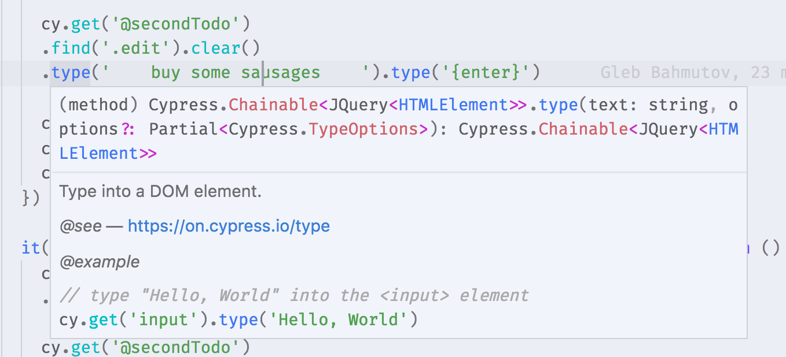

# TodoMVC [](https://travis-ci.org/cypress-io/cypress-example-todomvc) [](https://circleci.com/gh/cypress-io/cypress-example-todomvc) [](https://ci.appveyor.com/project/cypress-io/cypress-example-todomvc/branch/master)
 [![renovate-app badge][renovate-badge]][renovate-app]


This repo contains an example React App, with the tests written in Cypress.

Additionally this example app is configured to run tests in Circle CI and Travis CI.

The tests are written to be directly compared to the official TodoMVC tests.

Each test covers the same functionality found in the official TodoMVC tests but utilizes the Cypress API.

The [tests are heavily commented](cypress/integration/app_spec.js) to ease you into the Cypress API.

[You can find the official TodoMVC tests we are comparing to here.](https://github.com/tastejs/todomvc/blob/master/tests/test.js) [And here.](https://github.com/tastejs/todomvc/blob/master/tests/page.js) [And here.](https://github.com/tastejs/todomvc/blob/master/tests/testOperations.js)

## Help + Testing

The steps below will take you all the way through Cypress. It is assumed you have nothing installed except for node + git.

**If you get stuck, here is more help:**

* [Gitter Channel](https://gitter.im/cypress-io/cypress)
* [Cypress Docs](https://on.cypress.io)
* [Cypress CLI Tool Docs](https://github.com/cypress-io/cypress-cli)

### 1. Install Cypress

[Follow these instructions to install Cypress.](https://on.cypress.io/guides/installing-and-running#section-installing)

### 2. Fork this repo

If you want to experiment with running this project in Continous Integration, you'll need to [fork](https://github.com/cypress-io/cypress-example-todomvc#fork-destination-box) it first.

After forking this project in `Github`, run these commands:

```bash
## clone this repo to a local directory
git clone https://github.com/<your-username>/cypress-example-todomvc.git

## cd into the cloned repo
cd cypress-example-todomvc

## install the node_modules
npm install

## start the local webserver
npm start
```

The `npm start` script will spawn a webserver on port `8888` which hosts the TodoMVC app.

You can verify this by opening your browser and navigating to: [`http://localhost:8888`](http://localhost:8888)

You should see the TodoMVC app up and running. We are now ready to run Cypress tests.

### 3. Add the project to Cypress

[Follow these instructions to add the project to Cypress.](https://on.cypress.io/guides/installing-and-running#section-adding-projects)

### 4. Run in Continuous Integration

[Follow these instructions to run the tests in CI.](https://on.cypress.io/guides/continuous-integration#section-running-in-ci)

## Cypress IntelliSense

If you use modern IDE that supports TypeScript (like VSCode), you can benefit
from Cypress type declarations included with the `cypress` NPM module. Just
add `@ts-check` to the spec file and configure "dummy"
[tsconfig.json](tsconfig.json) file and see IntelliSense over `cy.<something>`
commands.



### Custom commands

This project also adds several custom commands in [cypress/support/commands.js](cypress/support/commands.js). They are useful to create one or more default todos from the tests.

```js
it('should append new items to the bottom of the list', function () {
  cy.createDefaultTodos().as('todos')
  // more test commands
})
```

To let TypeScript compiler know that we have added a custom command and have IntelliSense working, I have described the type signature of the custom command in file [cypress/support/index.d.ts](cypress/support/index.d.ts). Here is how this file looks; the type signatures should match the arguments custom commands expect.

```typescript
/// <reference types="cypress" />

declare namespace Cypress {
  interface Chainable<Subject> {
    /**
     * Create several Todo items via UI
     * @example
     * cy.createDefaultTodos()
     */
    createDefaultTodos(): Chainable<any>
    /**
     * Creates one Todo using UI
     * @example
     * cy.createTodo('new item')
     */
    createTodo(title: string): Chainable<any>
  }
}
```

To include the new ".d.ts" file into IntelliSense, I could update `tsconfig.json` or I could add another special comment to the JavaScript spec files - `/// <reference types="...>`.

```js
// type definitions for Cypress object "cy"
/// <reference types="cypress" />

// type definitions for custom commands like "createDefaultTodos"
// will resolve to "cypress/support/index.d.ts"
/// <reference types="../support" />
```

**Related:** [IntelliSense for custom Chai assertions added to Cypress](https://github.com/cypress-io/cypress-example-recipes/tree/master/examples/extending-cypress__chai-assertions#code-completion)

## Support

If you find errors in the type documentation, please
[open an issue](https://github.com/cypress-io/cypress/issues)

You can also ask questions in our [chat channel](https://on.cypress.io/chat)

[renovate-badge]: https://img.shields.io/badge/renovate-app-blue.svg
[renovate-app]: https://renovateapp.com/
